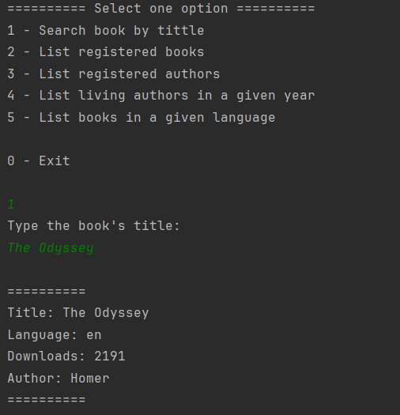
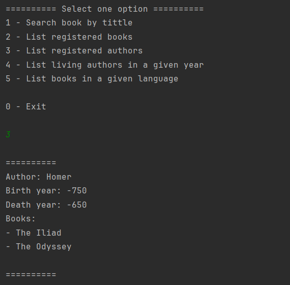

# Challenge Back-end - ONE: LiterAlura

<div align="center">
    
</div>

## Objetivos:
> Desenvolver um Catálogo de Livros que oferece interação textual (via console) com os usuários, proporcionando pelo menos 5 opções de interação. O catálogo consulta uma API externa para buscar livros, e armazena e consulta os dados no banco de dados para exibir informações sobre livros e autores. O objetivo é manipular dados JSON e realizar operações de CRUD em um banco de dados relacional com o uso do Spring Data JPA.

## Ferramentas Utilizadas:

<div align="left">
<a href="https://skillicons.dev">

</a>
</div>

## API para busca de livros:
Para realizar a busca de livros, foi utilizada a **Gutendex API**. O desafio consistiu em tratar os dados no formato JSON retornados pela API e utilizá-los de maneira eficiente, permitindo ao usuário consultar informações sobre livros e autores diretamente do banco de dados local.

**Endpoint utilizado:**  
`https://gutendex.com/`

> Exemplo de resposta da API:

```json
{
    "title": "The Odyssey",
    "authors": ["Homer"],
    "languages": ["en"],
    "downloads": 39782
}
```

## Funcionalidades do Sistema:

Este sistema permite ao usuário interagir com o catálogo de livros de diversas maneiras, utilizando um menu interativo via console com as seguintes opções:

1. **Buscar livro por título**: O usuário pode buscar um livro específico utilizando o título, consultando a API e exibindo as informações do livro.
2. **Listar livros cadastrados**: Exibe todos os livros registrados no banco de dados.
3. **Listar autores cadastrados**: Exibe todos os autores registrados no banco de dados.
4. **Listar autores vivos em um ano específico**: Filtra os autores que estavam vivos em um determinado ano.
5. **Listar livros em um idioma específico**: Permite filtrar os livros de acordo com o idioma especificado pelo usuário.

## Banco de Dados:
O sistema armazena as informações no banco de dados PostgreSQL, utilizando as entidades `Author` e `Book`. A relação entre essas entidades é feita por meio de um relacionamento **OneToMany** (um autor pode ter vários livros), e **ManyToOne** (cada livro pertence a um único autor). A aplicação utiliza **Spring Data JPA** para gerenciar as operações CRUD no banco de dados.

> Estrutura de dados do banco:
- **Tabela `authors`**: Contém informações sobre os autores, incluindo nome, ano de nascimento e ano de falecimento.
- **Tabela `books`**: Contém informações sobre os livros, incluindo título, idioma, número de downloads e o autor.

## Exemplo de interação:

Após o início da aplicação, o usuário verá o seguinte menu:

```
========== Select one option ==========  
1 - Search book by title  
2 - List registered books  
3 - List registered authors  
4 - List living authors in a given year  
5 - List books in a given language

0 - Exit
```

O usuário pode então selecionar uma das opções para interagir com o sistema, como exemplo:

<div align="center">
    

</div>


## Conclusão:
Este projeto implementa um catálogo de livros funcional com integração a uma API externa para consulta e um banco de dados para armazenar e gerenciar os dados. A experiência de trabalhar com dados JSON provenientes de uma API e integrá-los ao banco de dados foi valiosa para o aprendizado sobre consumo de APIs, manipulação de dados e operações CRUD.

A interação do usuário é feita por meio de um menu de console, o que proporciona uma interface simples e eficiente. O projeto também utiliza boas práticas de design e organização do código, como o uso do padrão **MVC** e a integração com o **Spring Data JPA** para facilitar a persistência dos dados.

Através desse desafio, aprendi a consumir dados de uma API externa, tratar esses dados, e realizar operações de leitura e escrita em um banco de dados relacional, aplicando conceitos de **Spring Boot** e **JPA**.
